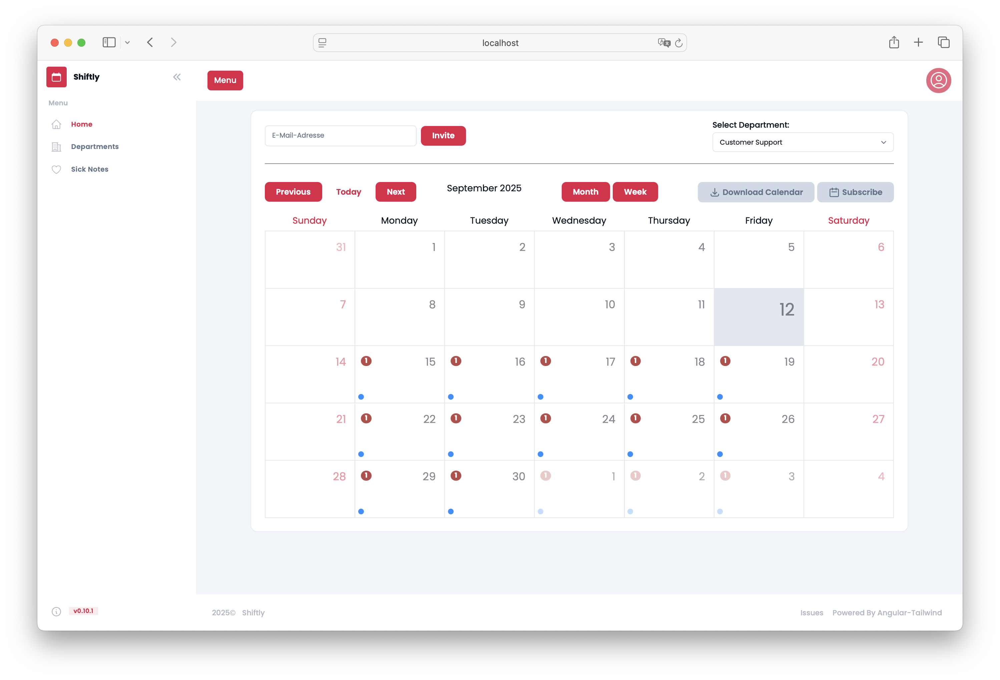
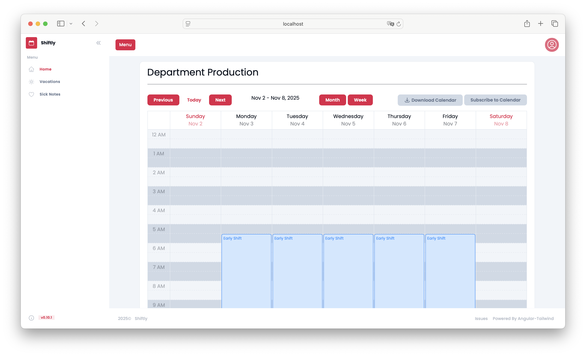
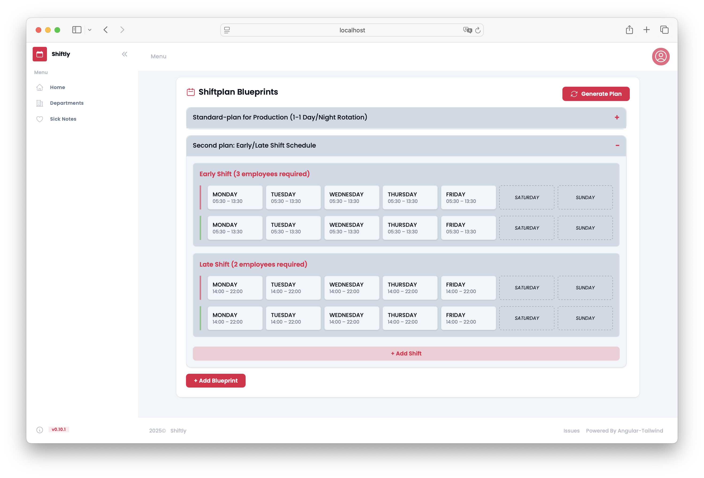
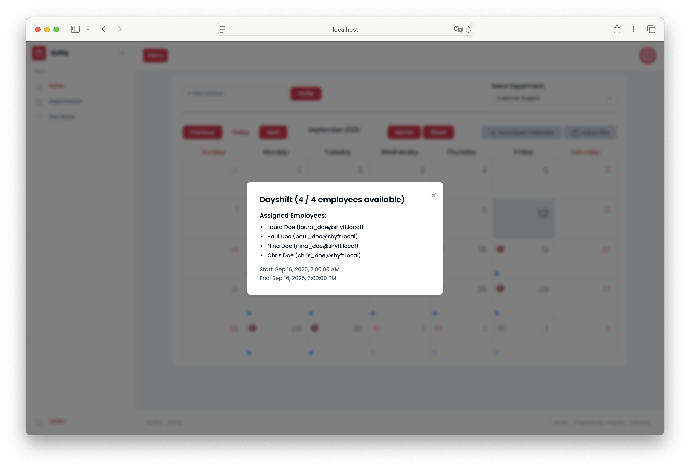
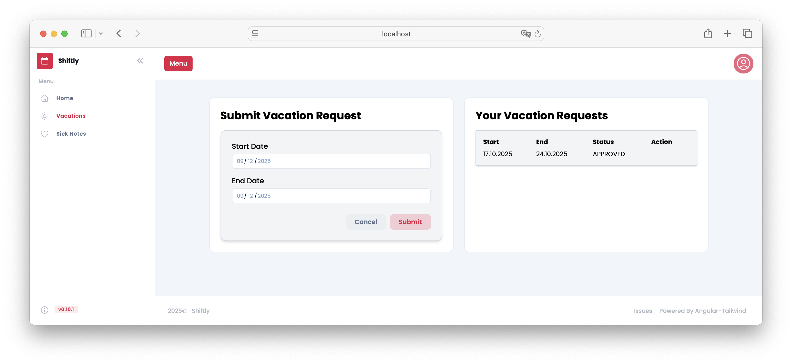
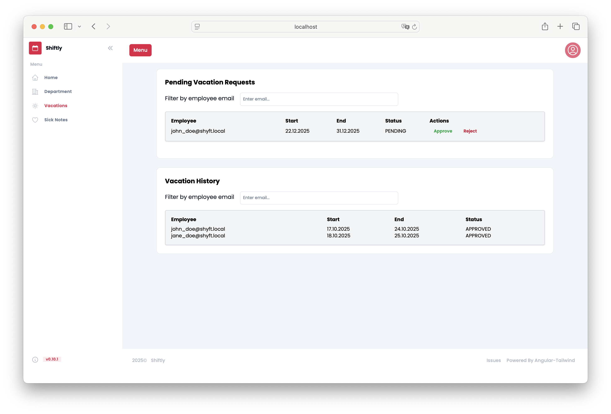
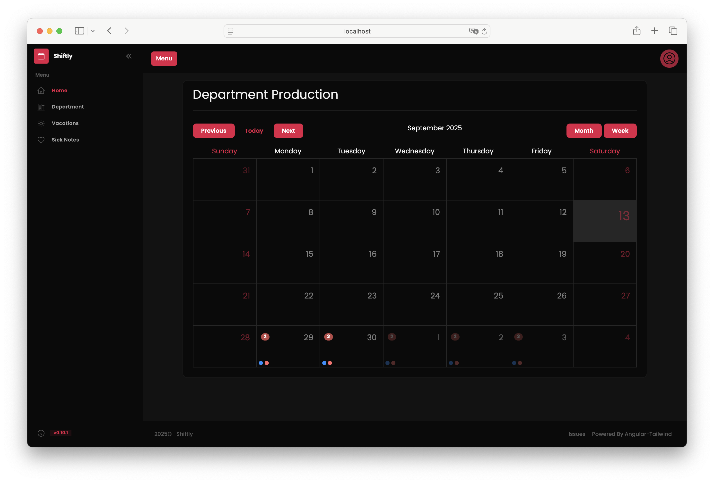
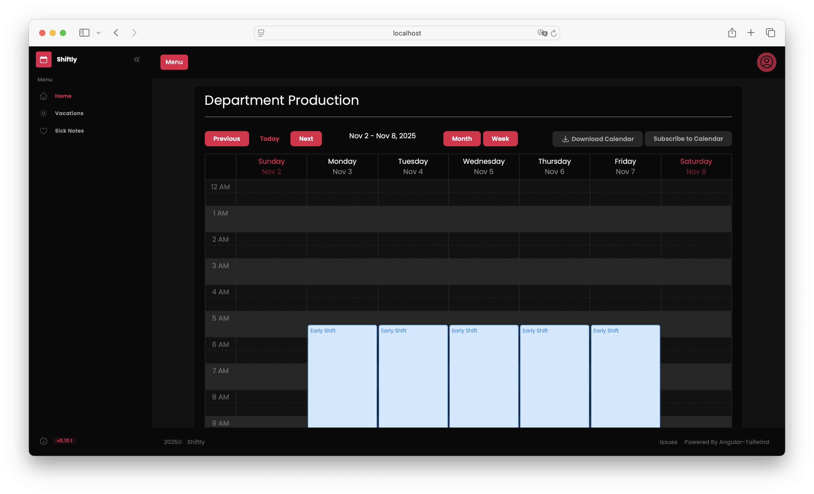
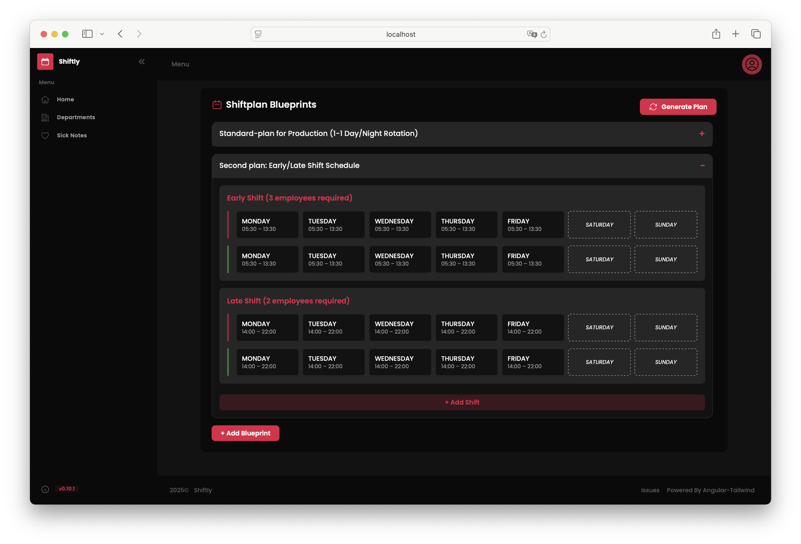
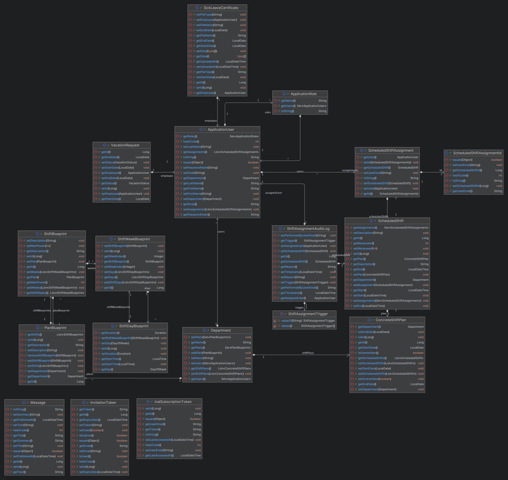

## About

**Shiftly** was developed as a group project for the Software Engineering and Project Management course at TU Wien (Vienna University of Technology) during the summer semester of 2025.

Shiftly is a web-based application designed to simplify shift scheduling for large organizations. It efficiently assigns employees to shifts while ensuring that each shift meets its required staffing levels. If adequate staffing cannot be achieved, the system automatically notifies the responsible manager via email. Among its key features, Shiftly includes an intelligent shift generation algorithm that considers employee vacations and assigns substitute workers ("jumpers") where needed. 

Time spent: approx. 600h total

Powered by [https://github.com/lannodev/angular-tailwind](https://github.com/lannodev/angular-tailwind) Copyright (c) 2024 Luciano Oliveira

## Features

**Role: System Administrator**
* Invite users to the system via email
* Manage departments
* Manage shift schedules across the organization
* View sick leave notifications, including uploaded medical documents

**Role: Supervisor**
* Manage shift schedules for their assigned department
* Invite users to their department as Employees or Jumpers
* View sick leave notifications for their department, including uploaded documents
* Review and approve or reject vacation requests within their department

**Role: Employee**
* View personal shift schedule
* Upload sick leave documentation
* Submit vacation requests
* Export personal shift schedule as a .ics file

## Shift Planning
* Each shift has a defined required headcount.
* Employees are automatically assigned using a rotation algorithm that ensures fair distribution of shifts.
* Approved vacation requests are taken into account during shift planning. * However, unplanned events like sudden resignations or sick leave are not considered.
* If staffing requirements are not met, available jumpers from an external pool are flexibly assigned to fill gaps.
* The jumper assignment algorithm respects individual availability and prevents multiple shift assignments on the same day.

## Technology Stack

Backend: Spring Boot (Java)

Frontend: Angular (TypeScript)

Database: H2 (In-Memory Database)

## Installation

You can start the application using Docker Compose by running `docker-compose up` from the project's root directory. 

* Frontend: [http://localhost:80](http://localhost:80)
* Backend: [http://localhost:8080](http://localhost:8080)
* Mailhog Web Interface [http://localhost:8025](http://localhost:8025).

Default username: `admin@shyft.local`
Default password: `password`

## Screenshots

**Light mode**

*Calendar view*

*Weekly Calendar View*

*Supervisor - Creation of Shift Plan*

*Supervisor - Details of a Shift*

*Employee - Vacation Request*

*Supervisor - Vacation Requests*

**Dark mode**

*Calendar view*

*Weekly Calendar View*

*Supervisor - Creation of Shift Plan*

## Class Diagram

